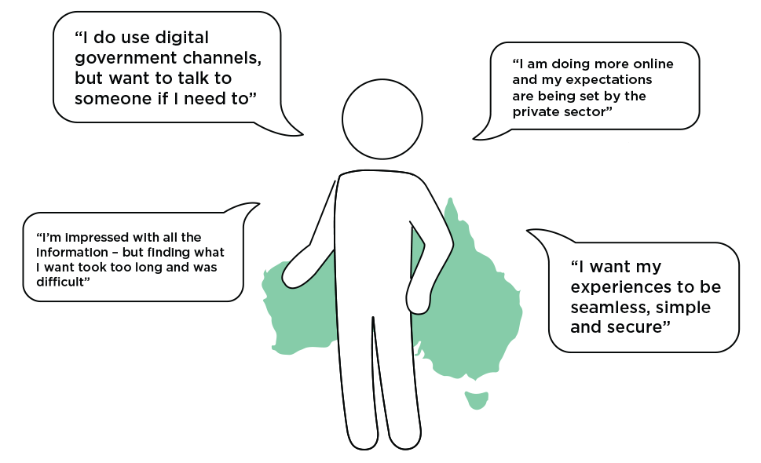

Putting the user at the centre of everything
============================================

Share to:
---------

  [](http://www.linkedin.com/shareArticle?mini=true&url=https%3A//www.dto.gov.au/blog/putting-user-centre-everything&title=Putting%20the%20user%20at%20the%20centre%20of%20everything&summary=The%20first%20design%20principle%20of%20the%26nbsp%3BDigital%20Service%20Standard%26nbsp%3Bis%20%E2%80%9Cusers%20first%E2%80%9D.%20To%20support%20this%20we%20are%20working%20to%20better%20understand%20what%20users%20really%20need%2C%20expect%2C%20prefer%20and%20actually%20experience%20when%20interacting%20with%20government.&source=Digital%20Transformation%20Office "Publish this post to LinkedIn") 

15/05/2015 - 9:03am

Author: 

The User Research Team

The first design principle of the [Digital Service Standard](../standard/foi_act_and_information_publication_scheme.md) is “users first”. To support this we are working to better understand what users really need, expect, prefer and actually experience when interacting with government.

There is no whole of government approach to understanding users. We are going to change that. Today there is a mountain of agency specific research but these results are often not shared and don’t take a whole of government view. The DTO has been collecting this research, analysing it and identifying key insights about user needs to share with the people designing and delivering government services.

Some of the key insights that we’ve found so far include:  

-   Whilst people currently prefer digital channels and are using them, they still want to be able to interact with a human if they need to, but this doesn’t need to be face to face or via phone - they are open to newer technologies such as web-chat and Skype.
-   Whilst digital government services are getting better, experiences still vary across agencies, services and channels, and there is much room for improvement.  
-   Finding information and services online is still particularly painful for people.  
-   Continual changes in policy and compliance requirements are frustrating for businesses, which means they rely heavily on intermediaries to help them manage this complexity.  
-   Barriers to self service exist and these are often due to infrastructure, cognitive barriers or attitudinal barriers.  ‘Status Quo bias’, which is the tendency to stick to one’s current position, can hold powerful sway over choices and behaviour.  This is particularly true in the small business market who are time poor.
-   Overall people are choosing to do more online.  According to ACMA, the top 4 things people are doing online include using the internet for research, email, general browsing and banking or paying bills.  Accessing and using Government websites ranked in at ninth.
-   Whilst people are doing more online, their expectations are being set by the private sector. 
-   A [survey of online shoppers by Capgemini](https://www.au.capgemini.com/resource-file-access/resource/pdf/Digital_Shopper_Relevancy__FULL_REPORT_.pdf) showed people are looking for consistency and convergence amongst different technologies and channels, and they have no pre-set views about what belongs in which channel but will use whatever channel or device is most relevant to them. 
-   Consistent with this, [Accenture concludes](http://www.accenture.com/au-en/Pages/insight-trends-service-design-fjord.aspx) that as our digital experiences across devices becomes more fragmented, there are four types of gaps that we need to address: the gap when we lose bandwidth, when we move between devices, when we’re handed over between different services, and when our data has changed and needs to be updated.  
-   There will always be people in the community who are unable or unwilling to adopt digital services and expect traditional channels or additional support.  Higher complexity interactions also warrant human interaction. There are also user segments such as larger business and intermediaries that expect a strong relationship with the agency. 
-   Self service technologies are being increasingly adopted when they are perceived to be useful, specifically: convenient, flexible and functional.  However, if those technologies are not seen as easy to use, they are unlikely to be adopted, irrespective of their usefulness or potential benefits.  
-   There is a lot of trust in government and the services it provides. Along with this trust is an expectation that we will respect privacy and keep information secure.  So government must effectively balance these requirements with usability.

These are just a few preliminary insights but we will share more as we continue our analysis.

What do you think?
------------------

We would love your feedback! We will continue to provide our thinking through blog links with the individual ideas and designs. We’ll be holding a number of public consultations and consultative events over the next few months – so subscribe to the DTO mailing list or the RSS feed to stay involved.

Also, a question for agencies. What’s been your experience with user research?  What does your agency need to efficiently and effectively conduct user research? Get in touch if we aren’t already talking to you.

  [](http://www.linkedin.com/shareArticle?mini=true&url=https%3A//www.dto.gov.au/blog/putting-user-centre-everything&title=Putting%20the%20user%20at%20the%20centre%20of%20everything&summary=The%20first%20design%20principle%20of%20the%26nbsp%3BDigital%20Service%20Standard%26nbsp%3Bis%20%E2%80%9Cusers%20first%E2%80%9D.%20To%20support%20this%20we%20are%20working%20to%20better%20understand%20what%20users%20really%20need%2C%20expect%2C%20prefer%20and%20actually%20experience%20when%20interacting%20with%20government.&source=Digital%20Transformation%20Office "Publish this post to LinkedIn") 

Related blogs
-------------

[Digital Community of Practice event – 4 September](foi_act_and_information_publication_scheme.md)

[‘Showing the thing’ was our theme last week in the Standards team](foi_act_and_information_publication_scheme.md)

[How do Australians really feel about digital government services?](foi_act_and_information_publication_scheme.md)

Comments (21)
-------------

Nathan replied on Mon, 2015-05-18 09:50 [Permalink](../comment/foi_act_and_information_publication_scheme.md#comment-121)

Comment: 

"My internet connection drops out a lot and is slow - perhaps a fibre broadband upgrade might be a good idea".

-   [reply](https://www.dto.gov.au/comment/reply/736/121)

Man replied on Mon, 2015-05-18 10:05 [Permalink](../comment/1foi_act_and_information_publication_scheme.md#comment-126)

Comment: 

The government is not an online shop.

People literally rely on the government for their life, not just their product. When you start keeping and controlling information in vested databases, you create a portal for macro operations to injure it's citizens.

Security and amendments to digital protections written into the constitution, and monitored by an independent committee will be the first step for wide-spread public adoption of the "one-file" approach.

-   [reply](https://www.dto.gov.au/comment/reply/736/126)

Harryws replied on Mon, 2015-05-18 10:44 [Permalink](../comment/1foi_act_and_information_publication_scheme.md#comment-131)

Comment: 

User self service is just pushing the task and responsibility on the user and away from the people we pay to do the work. I dont like that move.
 Secondly to access digital one has to have web access. The user again pays. The Government should make web access free across the country when dealing with the authorities. Free access at the reduced number of libraries with their ever decreasing opening hours is not the solution and "free" wifi at shops is just not free.
 Stop using PDF file format for Government documents. It is proprietary, not "Free" do what the UK is doing using Open Document Format (ODF)

-   [reply](https://www.dto.gov.au/comment/reply/736/131)

pauls replied on Mon, 2015-05-18 12:44 [Permalink](../comment/foi_act_and_information_publication_scheme.md#comment-141)

Comment: 

You make some great points Harry.

For those of us with ready access to Internet services and a high degree of literacy and familiarity with Internet tools, it's an easy trap to fall into to assume that everyone is like us: services like Twitter often create a sense of community that can be quite at odds with where the nation is as a whole is. Given that government services need to be accessible by all residents and citizens (both current and potential future), it's important to ensure these services are accessible by all in the way that is both possible and ideally convenient.

So although I think the "digital service standard" is important to support:
 a) digital needs to be one channel, and not seen as the primary channel, and
 b) for a "users first" strategy to really work, it needs to operate across channels, independently of digital channels, otherwise it immediately fails to be a user-first strategy.

Note that the PDF format has been an open standard since July 2008, and that there are open-source readers available. My personal view is that it's an OK standard for documents, and a much better option than documents based on the proprietary Microsoft product formats (Word, Excel, etc). It might be good for the government to offer links to alternative PDF viewers and readers.

-   [reply](https://www.dto.gov.au/comment/reply/736/141)

Matthew replied on Mon, 2015-05-18 13:22 [Permalink](../comment/foi_act_and_information_publication_scheme.md#comment-151)

Comment: 

"User self service is just pushing the task and responsibility on the user and away from the people we pay to do the work. "

How so? The current model requires the user to do just as much work, they're just filling out paper forms instead of digital versions. A large portion of the work that government employees who interface with the public are doing is grabbing the data from a form and then putting it into a computer and then clicking the button that does the thing the client wanted to do. Why can't the client just do that themselves which would then free up that employee to do something vastly more productive?

Right now centrelink offices include a few bays of PCs that can be used if someone doesn't have internet access at home. If someone still needs help using a computer then there can still be a small amount of staff available to help them or to enter the data for them.

The one time cost of moving to a digital solution is going to be a significantly more efficient use of tax payers money than paying customer service reps to do easily replaceable busy work until the end of time.

-   [reply](https://www.dto.gov.au/comment/reply/736/151)

simonfj replied on Sun, 2015-06-21 13:56 [Permalink](../comment/foi_act_and_information_publication_scheme.md#comment-501)

Comment: 

Harry,

That's a great comment (about "pushing responsibility onto the user"). You also make the obvious point, that "Secondly to access digital one has to have web access". Bit impossible to even take responsibility if you haven't the tools to do so. This is such an important point as we are (in the main) at the point where we want to use our own devices. The idea of using an institutional device, while very useful, means that we'd have to attend a physical .gov office (and then start learning how to use an application)

You can see the frustration a gov employee (like Mathew?) has to put up with in entering the same personal info into a departmental network's apps over an over again. We all share the common citizen's complaint of either, having to enter our personal info into a department's applications, or having some bored teller having to do it on our behalf.

Let me just point at the state silo's approach to the second prob and then point at how global unis have already solved it.
 The state silo approach.
 [http://www.itnews.com.au/News/388820,adelaide-switches-on-free-outdoor-w...](http://www.itnews.com.au/News/388820,adelaide-switches-on-free-outdoor-wi-fi.aspx)
 [http://www.itnews.com.au/News/386792,iinet-to-build-free-wi-fi-network-i...](http://www.itnews.com.au/News/386792,iinet-to-build-free-wi-fi-network-in-canberra.aspx#ixzz35blHKcz9)
 <http://www.vic.gov.au/wifi>

You'll find this approach is taken by most states, only in the large population centres of course. The inevitable result of this "supply orientated" approach? [http://www.itnews.com.au/News/388872,nsw-agencies-paying-too-much-for-te...](http://www.itnews.com.au/News/388872,nsw-agencies-paying-too-much-for-telecommunications.aspx)

Now look at the same aim from a global universities perspective. <https://www.eduroam.org/>
 I.e. If you come from a uni in one state, you can use your credentials to access (your stuff at) any other participating uni's network, globally. In progressive, we're already starting to see government's beginning to offer this service to their employees. <http://govroam.be/>
 There's no reason, with the right networking approach and (inter-institutional) ID, the same (demand orientated) approach couldn't be taken for/offered to all citizens. But that would entail that we see individual govs agree on the same "trust network".

The key to this comes down to giving all citizens an account, which is not built around/issued by a few Federal agencies. i.e. We'll see them take an inter-institutional approach to IDA. Something like this. <http://www.ukfederation.org.uk/content/Documents/FedDocs>

Re: the "user self service" problem. At the heart of this approach is making it dead easy for you, as a citizen to be in control of issuing/changing your basic details (where do you live being the main one) and informing all the other departments/governments at the same time. That attempt has been tried, at a Federal level, for ages. [http://www.theaustralian.com.au/business/technology/canberra-kicks-off-t...](http://www.theaustralian.com.au/business/technology/canberra-kicks-off-tell-us-once-pilot/story-fn4htb9o-1226067685097)

It hasn't worked (well) anywhere (in countries that don't trust a National government to issue a single ID) because it hasn't taken a user's perspective.One good example is the UK's approach to registering to vote. <https://gdstechnology.blog.gov.uk/2014/07/10/under-the-hood-of-ier/> All the service does is match your name & National insurance number (call it Medicare) with your Date of Birth (and probably address), which is issue by Local Electoral Office. Now if they match, fine, and many UK people have used this to register to vote. The GDS guys pat one another on the back, while the Local Electoral Officers must laborious do the 'change of address' (for just this one service).

If a voter moves, then the National guys are quite useless. The change is done, as is always the case, between two Local institutions (as can be seen in Fig 3). Once that change is made, all the other National institution's address databases could/can be updated. So this service is a great illustration of why a National mygov approach simply can't work. Utilities like this always require, especially if we want to "tell US/THEM once", a Local institution to provide the IDA.

Sorry for the lengthy reply. But there come a time where we need to put the INDIVIDUAL citizen before an individual level of government institutions. [https://mydex.org/blog/2013/11/29/the-role-of-the-individual-in-digital-...](https://mydex.org/blog/2013/11/29/the-role-of-the-individual-in-digital-by-default-public-services/)

-   [reply](https://www.dto.gov.au/comment/reply/736/501)

Pia Waugh (DTO) replied on Mon, 2015-05-18 13:07 [Permalink](../comment/foi_act_and_information_publication_scheme.md#comment-146)

Comment: 

Hi all, thanks for the comments. Firstly, this isn't about pushing the responsibility to citizens but rather, making it easier for citizens to get what they need whilst also better supporting citizens who need offline channels for service delivery. A lot of people actively want to do their business with government online, but want a lot better online services and information than they currently have access too. Which includes better standards, less PDFs, more API enabled stuff for mashing up government information and services, and generally bringing government up to the user expectations of the 21st century. thanks all for the comments, and keep them coming. More about some ways to tackle these issues in the coming blog posts!

Cheers,
 ​Pia

-   [reply](https://www.dto.gov.au/comment/reply/736/146)

DMA Canberra replied on Tue, 2015-05-26 11:52 [Permalink](../comment/foi_act_and_information_publication_scheme.md#comment-311)

Comment: 

Agree, digital is about making it easier for citizens, but it absolutely IS also about pushing responsibility onto citizens as well (or should be). That's exactly why compliance based organisations like Tax and Human Services are involved. They have been moving (correctly) to self service as self assessment and voluntary compliance for over 30 years, digital is just a channel that can enable that more effectively.

-   [reply](https://www.dto.gov.au/comment/reply/736/311)

simonfj replied on Thu, 2015-06-18 14:02 [Permalink](../comment/4foi_act_and_information_publication_scheme.md#comment-486)

Comment: 

Hi Pia,

Can I pick you up on this point - "this isn't about pushing the responsibility to citizens." (It's good a place to start as anywhere)
 This IS about pushing the responsibility to citizens. It's also about enabling them to be more independent and providing them with the skills and techniques to gain those government support services that they possibly don't know about - from three levels of public institutions (in this country). So there is quite a lot of education which must happen - not just in Aus, but between peers in different countries who work inside different publicly-funded networks.

That said we seem to have a sticking point is Aus because, with mygov.gov.au as it is now, we've come full circle; back to an online version of the Australia Card. i.e. One point of authentication. E.g. Even though we have Victoria coming on board (great!) we still haven't got past the old network concept that one (group of federal) agencies will provide the user's ID. [http://www.itnews.com.au/News/385974,victoria-jumps-on-board-with-mygov....](http://www.itnews.com.au/News/385974,victoria-jumps-on-board-with-mygov.aspx) N.B. "While Victorian online services will be set up to accept myGov credentials, myGov will not inversely accept native Victorian Government user credentials".

So, unlike the rest of the world, which is looking towards separating the IDA from the replying parties (user orgs), we've built in a single point of failure. That said, with mygov.gov.uk, we haven't yet made clear that which ID provider a citizen chooses will help to identify which services are the ones they consider most important. i.e. prioritize the services THEY require. N.B. "A trust framework is developed by a community whose members have similar goals and perspectives". <https://www.idecosystem.org/page/identity-ecosystem-framework>

I'll note this diagram, and web site's library. It's important because it outlines the basic model that governments are borrowing from the edu networks. <http://www.ukfederation.org.uk/content/Documents/HowItWorks>

It's always been a problem. Once a citizen is employed by a particular department, they throw away their citizen's hat and start working from an inside (a particular network's) perspective. So "putting a User in the centre of everything" becomes impossible. The challenge is usually seen as "delivering gov services" and not "sharing a <http://publicservicesnetwork.service.gov.uk/> " whose users must, in time, share space with other public service network users in different countries.

That kind of development continues. <https://ec.europa.eu/digital-agenda/en/connecting-europe-facility> N.B "DSI's".

But so far as "Putting user in the centre of everything", in Aus, like in GOV.UK, we seem to get confused about the difference between User organisations/Government institutions and the common citizens who must use their services, because there is no choice to do otherwise.

Any reason why we can't change the language and talk about "Putting the citizen in the centre of everything". It would certainly help in getting a few public services out of the global research networks. FUBAR. <https://tnc15.terena.org/core/presentation/140>

All the best.

-   [reply](https://www.dto.gov.au/comment/reply/736/486)

JackC replied on Mon, 2015-05-18 15:45 [Permalink](../comment/1foi_act_and_information_publication_scheme.md#comment-166)

Comment: 

When I hear the topic of "digital services" come up in regards to Australia it is usually prefaced by "limited access to", I find that there are several factors that contribute to this:

Restricted viewing outless and price gouging: If you want to watch the latest shows from within Australia you'll be hard pressed to find many options, let alone options that let you watch them on-demand! At the moment the biggest distributor is foxtel which is quite expensive for the one or two series that you like.

Bandwidth restrictions: this one is fairly obvious, many services are simply not available or have limited availability for Australians, streaming services such as Netflix, YouTube and twitch TV are practically unusable for many people, not just for viewers but for content creators who are then restricted on how they can share their product.

Other: on a side note I'm sorry but the Australian classification board is -deleted-, they \*should not\* have the power to refuse classification of media, digital or physical, by doing this they are also a risk to the availability of digital content to Australians

[moderator's note: this post has been edited to remove swearing]

-   [reply](https://www.dto.gov.au/comment/reply/736/166)

Pages
-----

-   -   1
    -   [2](../blog/putting-user-centre-everything%3Fpage=1.html "Go to page 2")
    -   [3](../blog/putting-user-centre-everything%3Fpage=2.html "Go to page 3")
-   -   [« first](foi_act_and_information_publication_scheme.md "Go to first page")
    -   [‹ previous](foi_act_and_information_publication_scheme.md "Go to previous page")
-   -   [next ›](../blog/putting-user-centre-everything%3Fpage=1.html "Go to next page")
    -   [last »](../blog/putting-user-centre-everything%3Fpage=2.html "Go to last page")

Add new comment
---------------

Your name

Comment (mandatory)

[More information about text formats](../filter/foi_act_and_information_publication_scheme.md)

### Plain text

-   No HTML tags allowed.
-   Web page addresses and e-mail addresses turn into links automatically.
-   Lines and paragraphs break automatically.

Leave this field blank

Save

Preview

