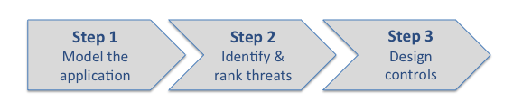
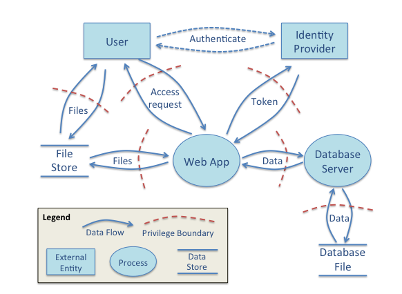

# Threat Modeling

Threat modeling provides a structured approach to identifying the information assets of value and the potential means of attack.  It looks at the application from the perspective of the attacker and identifies the highest risk areas for subsequent application of controls and tests.  

## Why Must ?

There are hundreds of security controls that can be applied to all parts of a digital service.  But which are the most important controls and where should they be applied? A well developed threat model provides the guidance to focus the security effort to maximise protection at minimal cost.  It provides a clear rationale for each control by linking them to the threat(s) that are mitigated.  

## How Do I?
Threat modeling is a three step process.

This guide provides a brief overview of the process. For more information, refer to the [OWASP guidance on threat modeling](https://www.owasp.org/index.php/Application_Threat_Modeling).

### Step 1 - Modeling the application

Create an application model that identifies the following components:
* **Trust Levels** that represent different access rights -  for example a user or administrator or system account. Define how the trust level is attained.
* **Assets** that are of interest to a potential attacker - for example a user account or a sensitive document.  Define which trust levels have access to each asset.
* **Entry Points** that may be exploited by an attacker - eg https port or login page.  Define which entry points are open to which trust levels.
* **External Dependencies** that may impose a threat but are not in the control of the application development team - for example a virtual server or firewall.

Draw a data flow diagram for the main use cases that shows the relationship between the modeled components.  The example below shows a fairly generic web application data flow diagram.  Substitute specific assets, trust levels, and entry points for your own system.

### Step 2 - Define and rank threats

Having understood the assets to be protected and the attack surface, the next step is to enumerate and rank each threat.  Threats should be categorised using the "STRIDE" threat type and ranked using a typical consequence / likelhood risk ranking model.

STRIDE Type |	Examples |	Security Control
 --- | --- | ---
Spoofing|	Threat action aimed to illegally access and use another user's credentials, such as username and password.|	Authentication
Tampering	| Threat action aimed to maliciously change/modify persistent data, such as persistent data in a database, and the alteration of data in transit between two computers over an open network, such as the Internet. |	Integrity
Repudiation	| Threat action aimed to perform illegal operations in a system that lacks the ability to trace the prohibited operations. |	Non-Repudiation
Information disclosure |	Threat action to read a file that one was not granted access to, or to read data in transit. |	Confidentiality
Denial of service	| Threat aimed to deny access to valid users, such as by making a web server temporarily unavailable or unusable.	| Availability
Elevation of privilege |	Threat aimed to gain privileged access to resources for gaining unauthorized access to information or to compromise a system.	| Authorization

Give each threat a likelihood value from 1 (low) to 5 (almost certain) and a consequence value from 1 (trivial) to 5 (catastrophic).  The overall rating is the sum of likelihood and consequence and so will be a number between 2 and 10.  The highest rating threats should be addressed first with appropriate controls.   

It is also important to revisit the threat assessment regularly throughout the life of the application to ensure that both the threat assessment is current and that the controls are effective.

### Step 3 - Determine controls

Each threat should be mitigated through the application of one or more controls.   In most cases, the controls are well defined best practices defined by security authorities such as ASD (Australian Signals Directorate). The threat modeling exercise described on this page can be used as a means to identify and prioritise the specific controls that are most important for your specific application risks.

Information on ASD ISM and OWASP controls is provided in the [Controls](controls.md) guide.   For threat modeling purposes the key activity is to link the relevant controls to the relevant threat so that there is a clear traceability to the rationale for applying a specific control.
